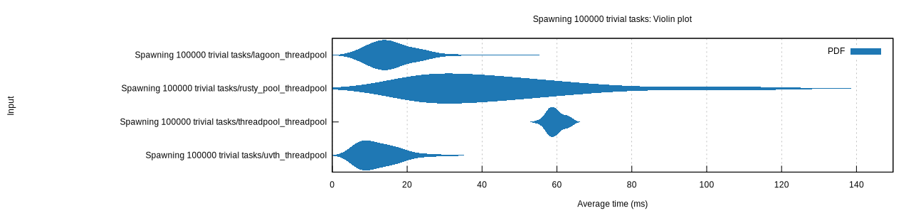

# Lagoon

[](https://crates.io/crates/lagoon)
[](https://docs.rs/lagoon/)

Lagoon is a thread pool crate that aims to address many of the problems with existing thread pool crates.

## Example

Lagoon's scoped jobs can be used for simple [rayon](https://github.com/rayon-rs/rayon/)-like data parallelism.

```rust
// A vector of the numbers 0 to 99
let mut data = (0..100).collect::<Vec<u32>>();

lagoon::ThreadPool::default().scoped(|s| {
    // For each element in the vector...
    for x in data.iter_mut() {
        // ...spawn a job that squares that element
        s.run(move || *x *= *x);
    }
});

// Demonstrate that the elements have indeed been squared
assert!((0..100)
    .map(|x| x * x)
    .zip(data.into_iter())
    .all(|(x, y)| x == y));
```

## Features

- **Scoped jobs**: Safely spawn jobs that have access to their parent scope!
- **Job handles**: Receive the result of a job when it finishes, or wait on it to finish!
- **Global pool**: A pay-for-what-you-use global thread pool that avoids dependencies fighting over resources!
- **Customise thread attributes**: Specify thread name, stack size, etc.

## Planned Features

- **Async support for job waiting**: Use the thread pool in an async context!

## Performance

Lagoon has very competitive performance. Below are timings required for each thread pool crate to spawn a new pool,
execute 100,000 trivial jobs, and then finish executing (i.e: smaller is better) compared to common alternative crates.

# 

```
Spawning 100000 trivial tasks/lagoon     time:   [15.124 ms 16.437 ms 17.871 ms]
Spawning 100000 trivial tasks/threadpool time:   [59.108 ms 59.549 ms 59.989 ms]
Spawning 100000 trivial tasks/uvth       time:   [11.494 ms 12.598 ms 13.750 ms]
Spawning 100000 trivial tasks/rusty_pool time:   [40.203 ms 44.778 ms 49.612 ms]
```

Benchmarks were run on an AMD Ryzen 7 3700x with 16 threads.

## License

Lagoon is licensed under the MIT license (see `LICENSE`) in the main repository.
